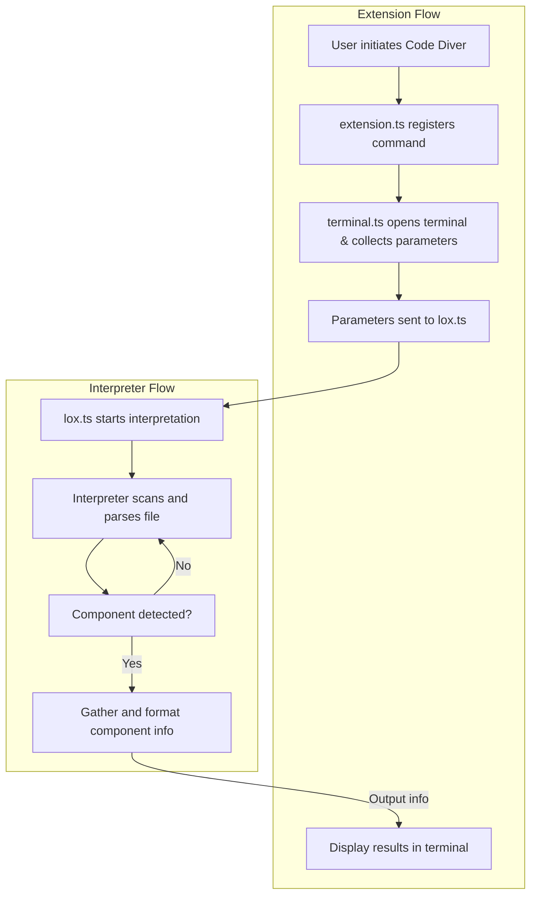
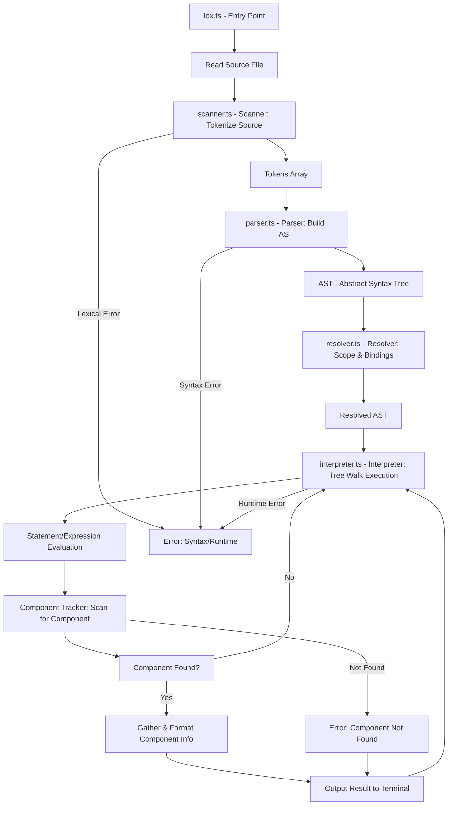

# Written Report - Code Diver

## Table of Contents

<details>

<summary>Click to Expand</summary>

- [Written Report - Code Diver](#written-report---code-diver)
  - [Table of Contents](#table-of-contents)
  - [Glossary](#glossary)
  - [Introduction](#introduction)
  - [Presentation of the Project](#presentation-of-the-project)
    - [What's a Moonshot Project](#whats-a-moonshot-project)
    - [What's my Moonshot Project](#whats-my-moonshot-project)
  - [Functional Specifications](#functional-specifications)
    - [Vision](#vision)
    - [Objectives](#objectives)
    - [Scope](#scope)
    - [Out of Scope](#out-of-scope)
    - [Organisation](#organisation)
      - [Stakeholders](#stakeholders)
      - [Milstones](#milstones)
      - [Risks and Assumptions](#risks-and-assumptions)
        - [Risks](#risks)
        - [Assumptions](#assumptions)
      - [Constraints](#constraints)
    - [Functional Requirements](#functional-requirements)
      - [2 Part Project](#2-part-project)
      - [Install the extension](#install-the-extension)
      - [Access the graphical interface](#access-the-graphical-interface)
      - [Input parameters](#input-parameters)
      - [Launch the interpreter](#launch-the-interpreter)
      - [Print informations about the component](#print-informations-about-the-component)
      - [Use Cases](#use-cases)
    - [Non-Functional Requirement](#non-functional-requirement)
      - [Performance](#performance)
      - [Usability](#usability)
      - [Reliability](#reliability)
      - [Portability](#portability)
        - [Maintainability](#maintainability)
      - [Security](#security)
      - [Compliance](#compliance)
  - [Technical Specifications](#technical-specifications)
    - [Technologie Stack](#technologie-stack)
      - [Programming Language](#programming-language)
      - [Extension](#extension)
      - [Interpreter](#interpreter)
      - [Lox](#lox)
      - [Developement Tools](#developement-tools)
    - [Architecture](#architecture)
      - [Flow](#flow)
      - [Interpreter Architecture](#interpreter-architecture)
      - [The Lox Language](#the-lox-language)
    - [Build and Development Workflow](#build-and-development-workflow)
    - [Packaging and Distribution](#packaging-and-distribution)
    - [Dependencies](#dependencies)
    - [Extensibility and Maintainability](#extensibility-and-maintainability)
    - [Security and Compliance](#security-and-compliance)

</details>

---

## Glossary

<details>

<summary>Click to Expand</summary>

- **VS Code**: Visual Studio Code, a free, open-source code editor developed by Microsoft, supporting a wide range of programming languages and workflows.
- **Extension**: A software add-on that adds features or functionality to VS Code, enhancing the development environment.
- **Interpreter**: A program that reads and executes code; in this project, it processes Lox files and analyzes component lifecycles.
- **Lox**: A compact, dynamically-typed, object-oriented programming language created by Robert Nystrom for educational purposes and interpreter development.
- **Component**: In this context, a variable or function in the code whose lifecycle and usage are being analyzed by Code Diver.
- **Command Palette**: The quick-access menu in VS Code, opened with Ctrl+Shift+P, used to run commands and access features.
- **Webview**: A custom user interface panel in VS Code extensions, rendered using HTML, CSS, and JavaScript.
- **Marketplace**: The Visual Studio Code Extension Marketplace where users can find, install, and manage extensions.
- **Impact Analysis**: The process of understanding the effects of changes or the flow of data/components in a codebase, helping developers assess consequences of modifications.
- **Stakeholder**: Any person or group with an interest in the project (e.g., user, developer, reviewer, or sponsor).
- **Moonshot Project**: A capstone project at ALGOSUP demonstrating a student's mastery of targeted skills, culminating in source code, a written report, and an oral presentation.

</details>

---

## Introduction

This document is the written report on my Moonshot Project, it will contain:

- An exhausitve presentation of the project,
- Analysis and specifications of the software development project,
- Software architecture choices,
- An argument for the choice of algorithms and their relevance to the problems to be solved,
- A presentation of the tests developed and the implementation of the software solution,
- Developments made or planned for the software solution,
- An analysis of the project's management and oversight.

## Presentation of the Project

### What's a Moonshot Project

A Moonshot Project is the showcase of your know-how, it spans the entirety of a students Journey at ALGOSUP, and allows students to validate, at the end of the course, that all the skills targeted by the training have been mastered.
Three productions are expected: all the source codes of the project, a written report in English, and an oral presentation in English in front of a jury of professionals.

### What's my Moonshot Project

My project, this project is a Visual Studio Code Extension (VS Code extension), Its name is Code Diver and it's objective is to help developers work more efficiently.
The main functionality of Code Diver, is to follow the evolution of an component of a software throughout it's execution path.

One of the major roadblock when joining a team to work on a piece of software, is understanding said the architecture, the inner working of said softaware.
This problem of integrating new software developers into software developement team is a massive and well known problem of the industry, as such a multitude of software exist to fight this problem, and they are very varied too:

- Documentation tools such as Doxygen, Sphinx or Read The Docs,
- Impact Analysis tools such as ESLint, ArchUnit or Lizard,
- AI Assistants such as SonarQube, CapeGemini, Cobol Colleague or WatsonX pour Z.

Code Diver is my humble contribution to these tools, it can be classified as a small scale Impact Analysis tool.

---

---

## Functional Specifications

### Vision

The vision for the Code Diver extension is to provide an intuitive tool to understand and visualise the lifecycle of a software's component.
This project's focus is to simplifie the work of developer, as such it as been designed to be simple to use and understand for developers disregarding their level.

By creating a VS Code extension we make it so the users do not have to change windows when working, conserving focus and momentum.

### Objectives

- Improve Productivity: Increase the resolution speed of tasks,
- Speed Up Integration: Reduce the time spent understanding the inner working of a software for newcomers,
- Be Accessible: Software developers can use and understand how to use the app regarding of their level,
- Maintain Momentum: Integrate Code Diver seamlessly into the work environment to maintain focus and concentration.

---

### Scope

Start the extension:

- The extension must be found in the Comand Pallete ('Crtl' + 'Shift' + 'P') under the name 'Code Diver: Start Dive',
- When activating the command a new terminal must be opened, and users can interact with the program.

Input a file:

- When in the graphical interface, users must be able to input a PATH to a file and get a confirmation that the file is found.

Available in the extension panel:

- The extension must be available in the extension market ('Crtl' + 'Shift' + 'X'),
- Users must be able to install and launch the extension found in the extension market.

Input parameter:

- When prompted the user must be able to select which type of component he is searching for,
- When prompted the user must be able to enter the name of a component that he is searching for.

Get informations on component:

- Once users have entered the file, the type of component and the name of said component, the extension starts interpreting the code while looking for the component,
- If the interpreter encounters the component, it must print out information on the component,
- In the case of a variable: component x, called by f; value was: y; value changed to z.

### Out of Scope

- Input multiple component: The extension cannot research multiple components at the same time,
- Language support: The extension support the little language Lox,
- Component diversity: Variables are the only component that can be researched,
- Webview interface: The extension does not have a dedicated webview (side panel),
- Timing: The extension does not keep track of the execution time.

> These features are not excluded permanently, they may appear in future updates.

---

### Organisation

#### Stakeholders

| Stakeholder | Role |
| --- | --- |
| Jason GROSSO | In charge of leading and executing the project. |
| ALGOSUP | Provide ressources and contacts |
| Reviewers | Grade the project |

#### Milstones

| Milestone | Description |
| --- | --- |
| Functional Specifications | Write out the functionalities and requirement |
| Technical Specifications | Specifie the technical stack and erchitecture |
| Version 1 | Release the first version of the extension |
| Written Report | Write a report on the project's conception |

#### Risks and Assumptions

##### Risks

- Bugs: Functionalities might be impacted by bugs causing delay,
- Lox: Only supporting a little language might attract users,
- VS Code Extensions: Low technical expertise on VS Code Extension might cause delay,
- Licensing Compliance: Failure to comply with the licences of the different dependencies might compromise the project,
- Juridic Compliance: Failure to comply with laws might compromise the project and the project manager.

##### Assumptions

- Users use Visual Studio Code as their IDE,
- Users need to follow the life cycle of software components,
- Users are using VS Code Extensions,
- Users want to use an impact analysis tools.

#### Constraints

- Time Constraints: Deadlines imposed by ALGOSUP,
- Legal Constraint: Compliance with laws and licenses.

---

### Functional Requirements

#### 2 Part Project

This Project can be divided into 2 parts:

- The Extension: Implemented into the IDE, sending and displaying information from the interpreter,
- The Interpreter: Interpret files send by the extensions, sends information to the extention.

#### Install the extension

**Description**: Users can download the Code Diver from the Extension Market of Visual Studio Code.
**Requirement**:

- Code Diver must have an Extension page,
- Code Diver must comply with the regulations on Extensions.

#### Access the graphical interface

**Description**: Users can access the graphical interface.
**Requirement**:

- Code Diver must have a graphical interface for the users to interact with,
- Code Diver must have a registered command that sends the users to the graphical interface.

#### Input parameters

**Description**: Users can input parameters to give to the interpreter.
**Requirement**:

- The graphical interface must asks for the path to the file, the type of component and the name of the component,
- The process must be blocked until the 3 parameters are filled with correct informations

#### Launch the interpreter

**Description**: Once the parameters are filled the interpreter interpret the files and look for the component.
**Requirement**:

- The graphical interface must start the interpreter with the parameters specified by the users,
- The Interpreter must open the file specified and look for the component.

#### Print informations about the component

**Description**: When the interpreter encounter the specified component it prints information about the component.
**Requirement**:

- The interpreter must recognise the component,
- The interpreter must print in a single line, relevant informations about the component,
- Who called the component, what value the component had, what value the component has after it has been called.

#### Use Cases

1. Install the Extension

   - Actor: User
   - Goal: Install Code Diver from the VS Code Extension Marketplace.
   - Preconditions: User has access to VS Code and the Marketplace.
   - Main Flow:
     1. User opens the Extensions panel in VS Code.
     2. User searches for "Code Diver".
     3. User clicks "Install".
   - Postconditions: Code Diver is installed and available in VS Code.

2. Access the Graphical Interface

    - Actor: User
    - Goal: Open the Code Diver graphical interface.
    - Preconditions: Code Diver is installed.
    - Main Flow:
        1. User opens the Command Palette (Ctrl+Shift+P).
        2. User runs the command Code Diver: Start Dive.
        3. The graphical interface appears.
    - Postconditions: User sees the interface to interact with Code Diver.

3. Input Parameters

    - Actor: User
    - Goal: Provide the path, component type, and component name to the interpreter.
    - Preconditions: The graphical interface is open.
    - Main Flow:
        1. User is prompted for the file path, component type, and component name.
        2. User enters each parameter.
        3. The interface validates the inputs and blocks progress until all are valid.
    - Postconditions: All required parameters are provided and validated.

4. Launch the Interpreter

    - Actor: User
    - Goal: Start the interpreter with the specified parameters.
    - Preconditions: All parameters are provided and valid.
    - Main Flow:
        1. User clicks a button or confirms to start analysis.
        2. The interpreter is launched with the given file and component details.
        3. The interpreter processes the file and searches for the component.
    - Postconditions: Interpreter runs and analyzes the specified file/component.

5. Print Information About the Component

    - Actor: Interpreter (system)
    - Goal: Display relevant information about the specified component.
    - Preconditions: Interpreter has found the component in the file.
    - Main Flow:
        1. Interpreter recognizes the component during analysis.
        2. Interpreter prints a single line with:
            - Who called the component
            - The value before the call
            - The value after the call
        3. User sees the output in the interface or terminal.
    - Postconditions: User receives concise, relevant information about the component's lifecycle.

---

### Non-Functional Requirement

#### Performance

The extension should respond to user actions (e.g., opening the graphical interface, running the interpreter) within 2 seconds.
The interpreter should process files of up to 1,000 lines in less than 5 seconds on a typical developer machine.

#### Usability

The graphical interface must be intuitive and require minimal training for new users.
All user prompts and error messages must be clear and actionable.
The extension must follow VS Code UI/UX guidelines for consistency.

#### Reliability

The extension must not crash VS Code or cause data loss.
The interpreter must handle invalid input gracefully and provide meaningful error messages.

#### Portability

The extension must work on Windows, macOS, and Linux versions of VS Code.
No platform-specific dependencies should prevent installation or use.

##### Maintainability

The codebase should be modular and documented to facilitate future updates and bug fixes.
Automated tests should cover core functionality of the interpreter and extension commands.

#### Security

The extension must not execute arbitrary code from user input without validation.
User data and file paths must not be transmitted outside the local machine.

#### Compliance

The extension must comply with VS Code Marketplace policies and relevant open-source licenses.

---

---

## Technical Specifications

### Technologie Stack

#### Programming Language

For the main programming language of this project, there was two options available: JavaScript and TypeScript; as these two languages that are used to build VS Code extensions, with TypeScript being recommended by VS Code.
Thus this project was programmed into TypeScript.

#### Extension

- Yeoman
  - **Purpose**
    - Yeoman is a scaffolding tool that helps developers quickly generate the structure and boilerplate code for new projects. It streamlines the setup process by providing generators for various project types, including web apps, libraries, and extensions.
  - **Details**
    - Yeoman operates through a command-line interface, where users select or install a generator (a template for a specific project type). The generator then prompts the user for project-specific information (such as name, description, and configuration options) and creates the necessary files and folders. Yeoman is highly extensible, allowing the community to create and share custom generators for different frameworks and platforms.
  - **Benefits**
    - Saves time by automating repetitive setup tasks.
    - Ensures consistency and best practices across projects.
    - Reduces the likelihood of configuration errors.
    - Makes it easy for new developers to start projects with a standard structure.

- VS Code Extension Generator
  - **Purpose**
    - The VS Code Extension Generator is a Yeoman generator specifically designed to scaffold the initial structure of a Visual Studio Code extension project. It provides all the essential files, configuration, and sample code needed to start developing an extension.
  - **Details**
    - When run (typically via yo code), the generator prompts the user for details such as extension name, display name, description, and language (TypeScript or JavaScript). It then creates a ready-to-build VS Code extension project, including package.json, extension activation code, sample commands, and recommended configuration files. The generator supports different extension types (e.g., command, webview, color theme) and integrates with VS Code's recommended development workflow.
  - **Benefits**
    - Accelerates the creation of new VS Code extensions by providing a working template.
    - Reduces setup errors and ensures compliance with VS Code extension guidelines.
    - Includes best practices and sample code to help developers get started quickly.
    - Supports both TypeScript and JavaScript, catering to different developer preferences.

#### Interpreter

- **Purpose**
  - The interpreter is the core component responsible for reading, analyzing, and executing code written in the Lox language. It processes user input, tracks the lifecycle of components, and outputs relevant information about their state and usage.
- **Details**
  - The interpreter is implemented in TypeScript and follows the structure and principles outlined in "Crafting Interpreters" by Robert Nystrom. It includes modules for scanning (tokenizing), parsing, and evaluating Lox code. The interpreter is designed to be modular, allowing for easy extension and maintenance. It communicates with the VS Code extension to receive input parameters and return analysis results.
- **Benefits**
  - Enables dynamic analysis of Lox code directly within VS Code.
  - Provides detailed insights into the lifecycle and usage of software components.
- - Modular design facilitates future enhancements and debugging.

#### Lox

- **Purpose**
  - Lox is a simple, dynamically-typed programming language created for educational purposes. It serves as the target language for the interpreter in this project, providing a controlled environment for demonstrating code analysis and interpretation.
- **Details**
  - Lox features a straightforward syntax and semantics, making it ideal for learning about interpreters and compilers. It supports variables, functions, control flow, and basic data types. The language specification is well-documented in "Crafting Interpreters" and is widely used in programming language courses and tutorials.
- **Benefits**
  - Simplifies the process of building and testing interpreters.
  - Provides a clear and consistent language model for analysis.
  - Reduces complexity, allowing focus on interpreter logic rather than language intricacies.
  - Well-supported by educational resources and community examples.

#### Developement Tools

- GitHub
  - **Purpose**
    - GitHub is a web-based platform for version control and collaborative software development. It enables individuals and teams to manage code repositories, track changes, and collaborate on projects using Git.
  - **Details**
    - GitHub provides hosting for Git repositories, offering tools for issue tracking, code review, pull requests, and project management. It integrates with CI/CD pipelines, supports open-source and private projects, and facilitates community contributions. GitHub also offers features like GitHub Actions for automation and GitHub Pages for documentation hosting.
  - **Benefits**
    - Centralizes code and documentation for easy access and collaboration.
    - Enables version control, making it easy to track changes and revert to previous states.
    - Facilitates teamwork through pull requests, code reviews, and issue tracking.
    - Supports open-source contributions and community engagement.
    - Integrates with a wide range of development tools and services.

- VS Code
  - **Purpose**
    - Visual Studio Code (VS Code) is a free, open-source code editor developed by Microsoft, designed to provide a powerful and flexible development environment for a wide range of programming languages and workflows.
  - **Details**
    - VS Code offers features such as syntax highlighting, intelligent code completion, debugging, integrated terminal, and support for extensions. It is cross-platform (Windows, macOS, Linux) and highly customizable, allowing users to tailor the editor to their needs. The extension marketplace enables users to add language support, themes, and tools for various workflows.
  - **Benefits**
    - Increases productivity with advanced editing, navigation, and debugging tools.
    - Supports a vast ecosystem of extensions for customization and added functionality.
    - Lightweight and fast, suitable for a variety of development tasks.
    - Cross-platform compatibility ensures a consistent experience across operating systems.
    - Strong community support and frequent updates.

- Crafting Interpreters by Robert NYSTROM
  - **Purpose**
    - "Crafting Interpreters" by Robert Nystrom is a comprehensive resource for learning how to design and implement interpreters for programming languages, using the Lox language as a case study.
  - **Details**
    - The book provides step-by-step guidance on building both a tree-walk interpreter and a bytecode virtual machine for the Lox language. It covers language design, parsing, scanning, error handling, and execution. The resource is available online for free and is widely used in programming language courses and self-study.
  - **Benefits**
    - Offers clear, practical instruction for building interpreters from scratch.
    - Helps readers understand core concepts in language design and implementation.
    - Provides real-world code examples and exercises.
    - Serves as a reference for both beginners and experienced developers interested in compilers and interpreters.
    - Encourages best practices and thoughtful software architecture.

### Architecture

As Code Diver is a 2 part program, the source code is divided in two folders and configuration/launching files:

```md
📁 code-diver
└──📁 .vscode
    └──📝 launch.json
└──📁 extension-src
    └──📄 extension.ts
    └──📄 terminal.ts
└──📁 interpreter-src
    └──📄 environment.ts
    └── ...
    └──📄 tokens.ts
└──📝 eslint.config.mjs
└──📝 package-lock.json
└──📝 package.json
└──📝 quick-start-extension.md
└──📝 tsconfig.json
```

| File | Role |
| :--- | --- |
| launch.json | VS Code launch configuration for debugging and running the extension |
| eslint.config.json | Configuration for ESLint, specifying linting rules and settings for the project. |
| package-lock.json | Automatically generated file that locks the versions of installed npm dependencies. |
| package.json | Project manifest: defines metadata, scripts, dependencies, and extension configuration. |
| quick-start-extension.json | Quick start guide or configuration for initializing or documenting the extension setup. |
| tsconfig.json | TypeScript configuration file specifying compiler options and project structure. |

#### Flow



#### Interpreter Architecture



- The mermaid graph illustrates the internal architecture and execution flow of the Code Diver tree-walk interpreter.
- The process begins with lox.ts as the entry point, which reads the source file and passes it to the scanner for tokenization.
- The scanner (scanner.ts) converts the source code into a sequence of tokens, which are then sent to the parser (parser.ts).
- The parser constructs an Abstract Syntax Tree (AST) representing the program's structure.
- The resolver (resolver.ts) analyzes the AST to resolve variable scopes and bindings, producing a resolved AST.
- The interpreter (interpreter.ts) performs a tree-walk execution of the resolved AST, evaluating statements and expressions.
- During execution, a component tracker scans for the specified component in the code.
- If the component is found, information is gathered and formatted for output to the terminal; otherwise, execution continues.
- The graph also highlights robust error handling at each stage, including lexical, syntax, runtime, and component-not-found errors, ensuring clear feedback to the user.

> Tree-walk execution: A Tree-walk execution is an interpretation strategy where the interpreter recursively traverses (or "walks") the Abstract Syntax Tree (AST) generated from the source code, evaluating each node according to its type. This approach directly executes the program structure as represented by the AST, making it simple to implement and well-suited for educational interpreters and small languages like Lox.

#### The Lox Language

The Lox language was created by Robert NYSTROM for his book "Crafting Interpreters" it is a little language, it is a compact object oriented language with dynamic typing and automatic memory management, it's primary use is to serve as a basis for the interpreters of the book.

Here you can find a breakdown of the grammar / syntax of Lox .[Link to the grammar](../technical/lox.md)

---

### Build and Development Workflow

- The project uses TypeScript for both the extension and interpreter, ensuring type safety and maintainability.
- The build process is managed via npm scripts defined in package.json, which handle compilation, linting, and packaging for VS Code.
- ESLint is configured to enforce code quality and consistency across the codebase.
- The extension can be debugged using VS Code's built-in debugger, with launch configurations provided in launch.json.

---

### Packaging and Distribution

- The extension is packaged using VS Code's vsce tool, producing a .vsix file for distribution.
- The extension is designed to comply with VS Code Marketplace requirements, including metadata, icon, and license information in package.json.
- Users can install the extension directly from the Marketplace or by using the .vsix package.

---

### Dependencies

- The project relies on the following key dependencies:
  - vscode: Provides the API for extension development and integration with the editor.
  - typescript: Enables static typing and modern JavaScript features.
  - eslint: Enforces code quality and style guidelines.
- All dependencies are managed via npm and locked using package-lock.json for reproducible builds.

---

### Extensibility and Maintainability

- The codebase is modular, with clear separation between extension logic and interpreter logic.
- New features (such as additional language support or UI enhancements) can be added by extending the relevant modules in extension-src/ or interpreter-src/.
- Documentation is provided in the documents directory, including functional and technical specifications, to support future development and onboarding.

---

### Security and Compliance

- The extension validates user input and does not execute arbitrary code, minimizing security risks.
- No user data or file paths are transmitted outside the local machine.
- The project adheres to open-source licenses and VS Code Marketplace policies.

---

---
