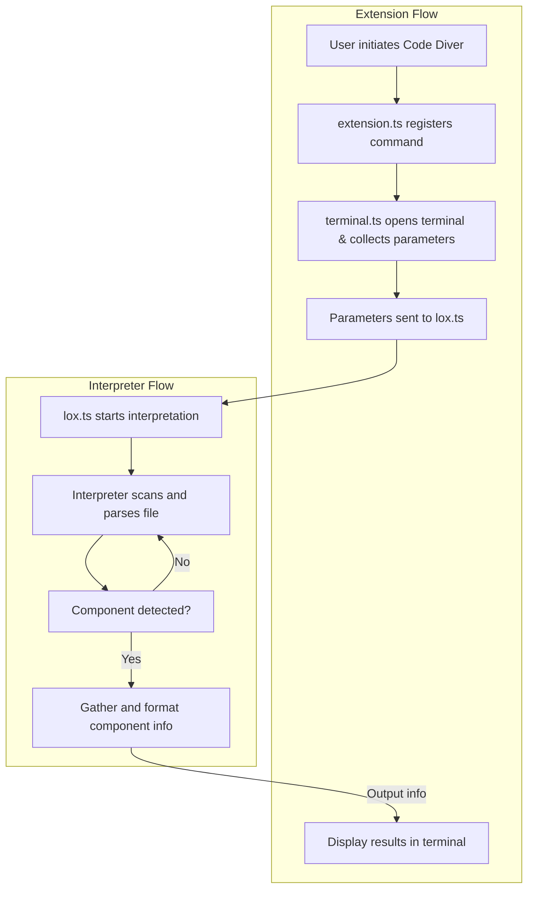
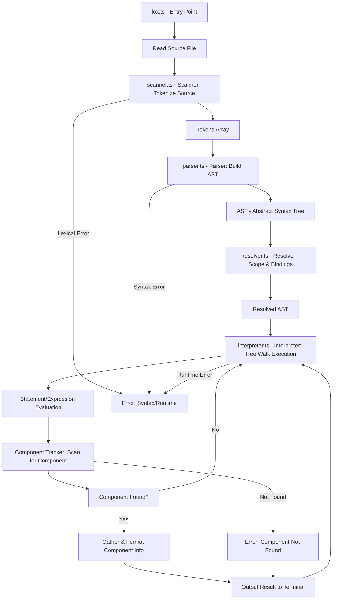

# Technical Specifications

## Table of Contents

<details>

<summary>Click to Expand</summary>

- [Technical Specifications](#technical-specifications)
  - [Table of Contents](#table-of-contents)
  - [Technologie Stack](#technologie-stack)
    - [Programming Language](#programming-language)
    - [Extension](#extension)
    - [Interpreter](#interpreter)
    - [Lox](#lox)
    - [Developement Tools](#developement-tools)
  - [Architecture](#architecture)
    - [Flow](#flow)
    - [Interpreter Architecture](#interpreter-architecture)
    - [The Lox Language](#the-lox-language)
  - [Build and Development Workflow](#build-and-development-workflow)
  - [Packaging and Distribution](#packaging-and-distribution)
  - [Dependencies](#dependencies)
  - [Extensibility and Maintainability](#extensibility-and-maintainability)
  - [Security and Compliance](#security-and-compliance)

</details>

## Technologie Stack

### Programming Language

For the main programming language of this project, there was two options available: JavaScript and TypeScript; as these two languages that are used to build VS Code extensions, with TypeScript being recommended by VS Code.
Thus this project was programmed into TypeScript.

### Extension

- Yeoman
  - **Purpose**
    - Yeoman is a scaffolding tool that helps developers quickly generate the structure and boilerplate code for new projects. It streamlines the setup process by providing generators for various project types, including web apps, libraries, and extensions.
  - **Details**
    - Yeoman operates through a command-line interface, where users select or install a generator (a template for a specific project type). The generator then prompts the user for project-specific information (such as name, description, and configuration options) and creates the necessary files and folders. Yeoman is highly extensible, allowing the community to create and share custom generators for different frameworks and platforms.
  - **Benefits**
    - Saves time by automating repetitive setup tasks.
    - Ensures consistency and best practices across projects.
    - Reduces the likelihood of configuration errors.
    - Makes it easy for new developers to start projects with a standard structure.

- VS Code Extension Generator
  - **Purpose**
    - The VS Code Extension Generator is a Yeoman generator specifically designed to scaffold the initial structure of a Visual Studio Code extension project. It provides all the essential files, configuration, and sample code needed to start developing an extension.
  - **Details**
    - When run (typically via yo code), the generator prompts the user for details such as extension name, display name, description, and language (TypeScript or JavaScript). It then creates a ready-to-build VS Code extension project, including package.json, extension activation code, sample commands, and recommended configuration files. The generator supports different extension types (e.g., command, webview, color theme) and integrates with VS Code's recommended development workflow.
  - **Benefits**
    - Accelerates the creation of new VS Code extensions by providing a working template.
    - Reduces setup errors and ensures compliance with VS Code extension guidelines.
    - Includes best practices and sample code to help developers get started quickly.
    - Supports both TypeScript and JavaScript, catering to different developer preferences.

### Interpreter

- **Purpose**
  - The interpreter is the core component responsible for reading, analyzing, and executing code written in the Lox language. It processes user input, tracks the lifecycle of components, and outputs relevant information about their state and usage.
- **Details**
  - The interpreter is implemented in TypeScript and follows the structure and principles outlined in "Crafting Interpreters" by Robert Nystrom. It includes modules for scanning (tokenizing), parsing, and evaluating Lox code. The interpreter is designed to be modular, allowing for easy extension and maintenance. It communicates with the VS Code extension to receive input parameters and return analysis results.
- **Benefits**
  - Enables dynamic analysis of Lox code directly within VS Code.
  - Provides detailed insights into the lifecycle and usage of software components.
- - Modular design facilitates future enhancements and debugging.

### Lox

- **Purpose**
  - Lox is a simple, dynamically-typed programming language created for educational purposes. It serves as the target language for the interpreter in this project, providing a controlled environment for demonstrating code analysis and interpretation.
- **Details**
  - Lox features a straightforward syntax and semantics, making it ideal for learning about interpreters and compilers. It supports variables, functions, control flow, and basic data types. The language specification is well-documented in "Crafting Interpreters" and is widely used in programming language courses and tutorials.
- **Benefits**
  - Simplifies the process of building and testing interpreters.
  - Provides a clear and consistent language model for analysis.
  - Reduces complexity, allowing focus on interpreter logic rather than language intricacies.
  - Well-supported by educational resources and community examples.

### Developement Tools

- GitHub
  - **Purpose**
    - GitHub is a web-based platform for version control and collaborative software development. It enables individuals and teams to manage code repositories, track changes, and collaborate on projects using Git.
  - **Details**
    - GitHub provides hosting for Git repositories, offering tools for issue tracking, code review, pull requests, and project management. It integrates with CI/CD pipelines, supports open-source and private projects, and facilitates community contributions. GitHub also offers features like GitHub Actions for automation and GitHub Pages for documentation hosting.
  - **Benefits**
    - Centralizes code and documentation for easy access and collaboration.
    - Enables version control, making it easy to track changes and revert to previous states.
    - Facilitates teamwork through pull requests, code reviews, and issue tracking.
    - Supports open-source contributions and community engagement.
    - Integrates with a wide range of development tools and services.

- VS Code
  - **Purpose**
    - Visual Studio Code (VS Code) is a free, open-source code editor developed by Microsoft, designed to provide a powerful and flexible development environment for a wide range of programming languages and workflows.
  - **Details**
    - VS Code offers features such as syntax highlighting, intelligent code completion, debugging, integrated terminal, and support for extensions. It is cross-platform (Windows, macOS, Linux) and highly customizable, allowing users to tailor the editor to their needs. The extension marketplace enables users to add language support, themes, and tools for various workflows.
  - **Benefits**
    - Increases productivity with advanced editing, navigation, and debugging tools.
    - Supports a vast ecosystem of extensions for customization and added functionality.
    - Lightweight and fast, suitable for a variety of development tasks.
    - Cross-platform compatibility ensures a consistent experience across operating systems.
    - Strong community support and frequent updates.

- Crafting Interpreters by Robert NYSTROM
  - **Purpose**
    - "Crafting Interpreters" by Robert Nystrom is a comprehensive resource for learning how to design and implement interpreters for programming languages, using the Lox language as a case study.
  - **Details**
    - The book provides step-by-step guidance on building both a tree-walk interpreter and a bytecode virtual machine for the Lox language. It covers language design, parsing, scanning, error handling, and execution. The resource is available online for free and is widely used in programming language courses and self-study.
  - **Benefits**
    - Offers clear, practical instruction for building interpreters from scratch.
    - Helps readers understand core concepts in language design and implementation.
    - Provides real-world code examples and exercises.
    - Serves as a reference for both beginners and experienced developers interested in compilers and interpreters.
    - Encourages best practices and thoughtful software architecture.

## Architecture

As Code Diver is a 2 part program, the source code is divided in two folders and configuration/launching files:

```md
📁 code-diver
└──📁 .vscode
    └──📝 launch.json
└──📁 extension-src
    └──📄 extension.ts
    └──📄 terminal.ts
└──📁 interpreter-src
    └──📄 environment.ts
    └── ...
    └──📄 tokens.ts
└──📝 eslint.config.mjs
└──📝 package-lock.json
└──📝 package.json
└──📝 quick-start-extension.md
└──📝 tsconfig.json
```

| File | Role |
| :--- | --- |
| launch.json | VS Code launch configuration for debugging and running the extension |
| eslint.config.json | Configuration for ESLint, specifying linting rules and settings for the project. |
| package-lock.json | Automatically generated file that locks the versions of installed npm dependencies. |
| package.json | Project manifest: defines metadata, scripts, dependencies, and extension configuration. |
| quick-start-extension.json | Quick start guide or configuration for initializing or documenting the extension setup. |
| tsconfig.json | TypeScript configuration file specifying compiler options and project structure. |

### Flow



### Interpreter Architecture



- The mermaid graph illustrates the internal architecture and execution flow of the Code Diver tree-walk interpreter.
- The process begins with lox.ts as the entry point, which reads the source file and passes it to the scanner for tokenization.
- The scanner (scanner.ts) converts the source code into a sequence of tokens, which are then sent to the parser (parser.ts).
- The parser constructs an Abstract Syntax Tree (AST) representing the program's structure.
- The resolver (resolver.ts) analyzes the AST to resolve variable scopes and bindings, producing a resolved AST.
- The interpreter (interpreter.ts) performs a tree-walk execution of the resolved AST, evaluating statements and expressions.
- During execution, a component tracker scans for the specified component in the code.
- If the component is found, information is gathered and formatted for output to the terminal; otherwise, execution continues.
- The graph also highlights robust error handling at each stage, including lexical, syntax, runtime, and component-not-found errors, ensuring clear feedback to the user.

> Tree-walk execution: A Tree-walk execution is an interpretation strategy where the interpreter recursively traverses (or "walks") the Abstract Syntax Tree (AST) generated from the source code, evaluating each node according to its type. This approach directly executes the program structure as represented by the AST, making it simple to implement and well-suited for educational interpreters and small languages like Lox.

### The Lox Language

The Lox language was created by Robert NYSTROM for his book "Crafting Interpreters" it is a little language, it is a compact object oriented language with dynamic typing and automatic memory management, it's primary use is to serve as a basis for the interpreters of the book.

Here you can find a breakdown of the grammar / syntax of Lox .[Link to the grammar](lox.md)

---

## Build and Development Workflow

- The project uses TypeScript for both the extension and interpreter, ensuring type safety and maintainability.
- The build process is managed via npm scripts defined in package.json, which handle compilation, linting, and packaging for VS Code.
- ESLint is configured to enforce code quality and consistency across the codebase.
- The extension can be debugged using VS Code's built-in debugger, with launch configurations provided in launch.json.

---

## Packaging and Distribution

- The extension is packaged using VS Code's vsce tool, producing a .vsix file for distribution.
- The extension is designed to comply with VS Code Marketplace requirements, including metadata, icon, and license information in package.json.
- Users can install the extension directly from the Marketplace or by using the .vsix package.

---

## Dependencies

- The project relies on the following key dependencies:
  - vscode: Provides the API for extension development and integration with the editor.
  - typescript: Enables static typing and modern JavaScript features.
  - eslint: Enforces code quality and style guidelines.
- All dependencies are managed via npm and locked using package-lock.json for reproducible builds.

---

## Extensibility and Maintainability

- The codebase is modular, with clear separation between extension logic and interpreter logic.
- New features (such as additional language support or UI enhancements) can be added by extending the relevant modules in extension-src/ or interpreter-src/.
- Documentation is provided in the documents directory, including functional and technical specifications, to support future development and onboarding.

---

## Security and Compliance

- The extension validates user input and does not execute arbitrary code, minimizing security risks.
- No user data or file paths are transmitted outside the local machine.
- The project adheres to open-source licenses and VS Code Marketplace policies.

---
